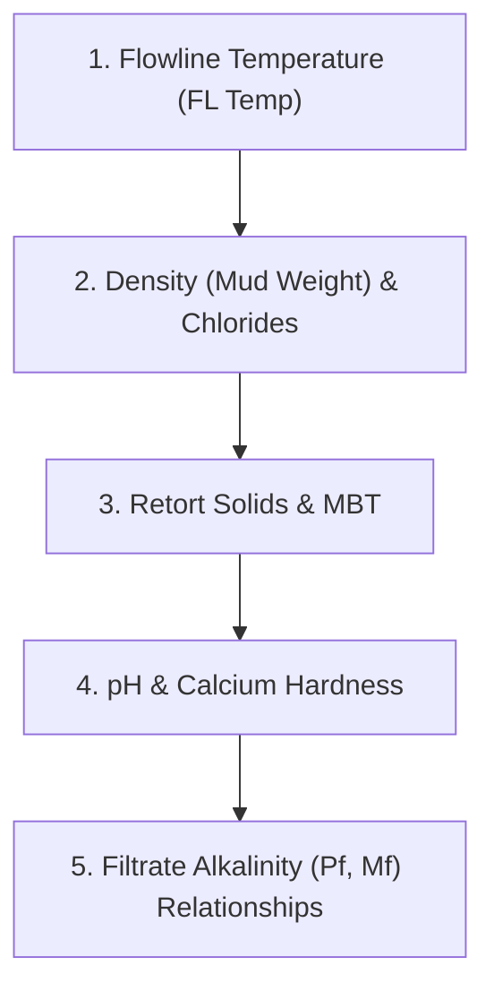

# WBF Contaminants Diagnostic & Treatment Guide (Baroid Core)

This study guide has been prepared to help you study and pass the **Baroid Core** course exams and homeworks. It is strictly based on the guidelines in the **Baroid Core Participant Guide (Unit 19 - WBF Contaminants)** and the **BAROID Fluids Handbook**.

---

## The 5-Step Baroid Diagnostic Workflow

To diagnose mud contamination accurately and avoid misidentification, always follow this step-by-step sequential workflow when analyzing daily mud checks (comparing **Day 1** to **Day 2**):

1. **1. FL Temp (°F):** A massive temperature spike points directly to thermal degradation (Thermal Flocculation).
2. **2. Density & Chlorides (mg/L):** 
   - Mud Weight drops + Chlorides constant/drop = *Fresh Water Influx*.
   - Mud Weight drops + Chlorides spike = *Salt Water Influx (Salt Water Flow)*.
   - Mud Weight stable/increases + Chlorides spike = *Solid Salt (NaCl) Evaporite dissolution*.
3. **3. Retort Solids (%) & MBT (lb/bbl bentonite eq):**
   - MBT increases + Retort solids increase = *Active Drilled Solids (hydratable clays/shales)*.
   - MBT stable + Retort solids (and Sand %) increase = *Inactive Drilled Solids (sand, limestone, quartz)*.
4. **4. pH & Calcium Hardness (mg/L):**
   - High pH (>11.5) + High Calcium Hardness = *Cement Contamination* (fresh cement releases both calcium and hydroxide OH-).
   - Low/Dropping pH (<9.0) + High Calcium Hardness = *Anhydrite / Gypsum Contamination* (releases calcium but consumes carbonate buffer, lowering pH).
5. **5. Filtrate Alkalinities ($P_f$, $M_f$):**
   - $2P_f < M_f$: Indicates the presence of **Bicarbonates ($HCO_3^-$)**. Treatment: Lime ($Ca(OH)_2$).
   - $2P_f = M_f$: Indicates the presence of **Carbonates ($CO_3^{2-}$)**. Treatment: Gypsum ($CaSO_4$) or Lime.
   - $2P_f > M_f$: Indicates coexisting Carbonates and Hydroxides.

---

## Chemical Treatment & Dosage Calculations

To calculate chemical treatment dosages in lb/bbl (field units), use the following formula from the Baroid manual:

$$\text{Treatment Dosage (ppb)} = (\text{Affected Concentration} - \text{Original Concentration}) \times \text{Conversion Factor}$$

### Official Baroid Conversion Factors (from Fluids Handbook, page 327):

| Contaminant to Remove | Chemical Treatment | Conversion Factor | Primary Chemical Reaction |
| :--- | :--- | :--- | :--- |
| **Bicarbonate ($HCO_3^-$)** | Lime [$Ca(OH)_2$] | **`0.00043`** | $Ca(OH)_2 + HCO_3^- \to CaCO_3 \downarrow + H_2O + OH^-$ |
| **Calcium from Cement ($Ca^{++}$)** | Sodium Bicarbonate [$NaHCO_3$] | **`0.000734`** | $Ca(OH)_2 + NaHCO_3 \to CaCO_3 \downarrow + NaOH + H_2O$ |
| **Calcium from Anhydrite ($Ca^{++}$)** | Soda Ash [$Na_2CO_3$] | **`0.000925`** | $Ca^{++} + Na_2CO_3 \to CaCO_3 \downarrow + 2Na^+$ |
| **Carbonate ($CO_3^{2-}$)** | Gypsum [$CaSO_4 \cdot 2H_2O$] | **`0.0008`** | $CaSO_4 + CO_3^{2-} \to CaCO_3 \downarrow + SO_4^{2-}$ |

*Note: While some industry sources use 0.000928 for Soda Ash treatment, the Baroid Fluids Handbook (p. 327) explicitly specifies **0.000925**. Use 0.000925 for strict validation in Baroid exams.*

---

# The 14 Study Cases in Detail

Here is the complete reference of all 14 cases included in the simulator.

---

### Case 1: High Temperature (Thermal Degradation)

| Mud Property | Day 1 (Base) | Day 2 (Affected) | Change Status |
| :--- | :---: | :---: | :--- |
| **FL Temp (°F)** | 120 | **185** | **Extreme Temperature Spike** |
| Weight (lb/gal) | 14.0 | 14.0 | No Change |
| PV (cP) / YP (lb/100ft²) | 30 / 10 | 45 / 18 | Viscosity & YP increase (Thermal Flocculation) |
| API Filtrate (ml) | 6.0 | 11.1 | Filtrate increases (polymer degradation) |
| MBT (lb/bbl) | 2.5 | 2.5 | No Change |
| Sand Content (%) | Tr | Tr | No Change |
| pH / Pm | 10.0 / 1.5 | 9.1 / 0.7 | Drop slightly due to water dissociation |
| Pf / Mf | 1.0 / 1.8 | 0.7 / 1.1 | Decline in alkalinity buffer |
| Chlorides (mg/L) | 300 | 300 | No Change |
| Hardness Ca++ (mg/L) | 100 | 100 | No Change |

* **Contaminant:** High Temperature
* **Primary Treatment:** Dilute system with base fluid
* **Dosage:** 0 lb/bbl (Not applicable)
* **Diagnostic Rationale:** Flowline temperature increased to 185°F. Since chlorides, density, and hardness remain constant, we can rule out chemical influxes. Rheology and fluid loss rose due to clay thermal flocculation and polymer thermal degradation.

---

### Case 2: Salt Water Influx

| Mud Property | Day 1 (Base) | Day 2 (Affected) | Change Status |
| :--- | :---: | :---: | :--- |
| FL Temp (°F) | 120 | 125 | No Change |
| **Weight (lb/gal)** | 14.0 | **13.6** | **Decrease** (diluted by water) |
| PV (cP) / YP (lb/100ft²) | 30 / 10 | 27 / 18 | PV drops (solids dilution), YP increases |
| Retort (Solids / Water %) | 17 / 83 | **13 / 87** | Solids decrease, water volume increases |
| MBT (lb/bbl) | 2.5 | **2.0** | Clay concentration diluted |
| **Sand Content (%)** | Tr | Tr | No Change |
| pH / Pm | 10.0 / 1.5 | 8.3 / 0.5 | Severe pH and alkalinity drop |
| Pf / Mf | 1.0 / 1.8 | 0.2 / 1.3 | Alkalinity drop |
| **Chlorides (mg/L)** | 300 | **6000** | **Massive salting/chlorides spike** |
| Hardness Ca++ (mg/L) | 100 | 150 | Slight increase from influx salts |

* **Contaminant:** Salt Water Influx
* **Primary Treatment:** Increase density to stop influx, then dilute
* **Dosage:** 0 lb/bbl (Not applicable)
* **Diagnostic Rationale:** Density and retort solids drop, indicating water entry. Chlorides spike to 6,000 mg/L, proving the water is highly saline. YP rises because the salt screens clay electrical double layers, causing charge flocculation.

---

### Case 3: Fresh Water Influx

| Mud Property | Day 1 (Base) | Day 2 (Affected) | Change Status |
| :--- | :---: | :---: | :--- |
| FL Temp (°F) | 120 | 125 | No Change |
| **Weight (lb/gal)** | 14.0 | **13.6** | **Decrease** (diluted by water) |
| PV (cP) / YP (lb/100ft²) | 30 / 10 | **24 / 7** | Both decrease (pure mechanical dilution) |
| Retort (Solids / Water %) | 17 / 83 | **13 / 87** | Total solids volume drops |
| MBT (lb/bbl) | 2.5 | **2.0** | Clay concentration diluted |
| **Sand Content (%)** | Tr | Tr | No Change |
| pH / Pm | 10.0 / 1.5 | 9.3 / 1.0 | Diluted pH and alkalinity |
| Pf / Mf | 1.0 / 1.1 | 0.8 / 0.9 | Proportional decrease |
| **Chlorides (mg/L)** | 1200 | **600** | **Chlorides drop to half** |
| Hardness Ca++ (mg/L) | 100 | 80 | Diluted calcium hardness |

* **Contaminant:** Fresh Water Influx
* **Primary Treatment:** Stop the influx weighting up
* **Dosage:** 0 lb/bbl (Not applicable)
* **Diagnostic Rationale:** Density and solids drop, indicating water entry. Chlorides and hardness drop proportionally. Since no salt is added, there is no flocculation, so both PV and YP decrease due to mechanical dilution.

---

### Case 4: Cement

| Mud Property | Day 1 (Base) | Day 2 (Affected) | Change Status |
| :--- | :---: | :---: | :--- |
| FL Temp (°F) | 120 | 123 | No Change |
| Weight (lb/gal) | 14.0 | 14.1 | No Change |
| PV (cP) / YP (lb/100ft²) | 30 / 10 | 45 / 18 | Flocculated rheology |
| API Filtrate (ml) | 6.0 | **28.8** | **Massive fluid loss spike** |
| MBT (lb/bbl) | 2.5 | 2.5 | No Change |
| Sand Content (%) | Tr | Tr | No Change |
| **pH / Pm** | 10.0 / 1.5 | **12.1 / 6.7** | **Massive pH & Mud Alkalinity spike** |
| Pf / Mf | 1.0 / 1.8 | **4.4 / 4.5** | Pf matches Mf ($2Pf > Mf$, high OH-) |
| Chlorides (mg/L) | 300 | 300 | No Change |
| **Hardness Ca++ (mg/L)** | 100 | **800** | **Calcium hardness spikes** |

* **Contaminant:** Cement
* **Primary Treatment:** Add Sodium bicarbonate (NaHCO3)
* **Dosage:** **0.5138 lb/bbl**
* **Diagnostic Rationale:** Calcium spikes to 800 mg/L and pH/Pm jump to 12.1/6.7. The $2Pf > Mf$ relationship confirms high hydroxide ($OH^-$) ions from cement hydrate $[Ca(OH)_2]$. High pH and calcium flocculate the bentonite, destroying filtrate control.
* **Calculation:**
  $$\Delta Ca^{++} = 800 - 100 = 700\text{ mg/L}$$
  $$\text{Dosage} = 700 \times 0.000734 = \mathbf{0.5138\text{ lb/bbl}}$$

---

### Case 5: Anhydrite / Gypsum

| Mud Property | Day 1 (Base) | Day 2 (Affected) | Change Status |
| :--- | :---: | :---: | :--- |
| FL Temp (°F) | 120 | 125 | No Change |
| Weight (lb/gal) | 14.0 | 14.1 | No Change |
| PV (cP) / YP (lb/100ft²) | 30 / 10 | 45 / 18 | Clay flocculation increases rheology |
| API Filtrate (ml) | 6.0 | 11.1 | Flocculation increases fluid loss |
| MBT (lb/bbl) | 2.5 | 2.5 | No Change |
| Sand Content (%) | Tr | Tr | No Change |
| **pH / Pm** | 10.0 / 1.5 | **8.3 / 0.5** | **pH and alkalinity drop** |
| Pf / Mf | 1.0 / 1.8 | **0.2 / 1.3** | Depressed alkalinity ($2Pf < Mf$, high HCO3-) |
| Chlorides (mg/L) | 300 | 300 | No Change |
| **Hardness Ca++ (mg/L)** | 100 | **800** | **Calcium hardness spikes** |

* **Contaminant:** Anhydrite / Gypsum
* **Primary Treatment:** Add Soda ash (Na2CO3)
* **Dosage:** **0.6475 lb/bbl**
* **Diagnostic Rationale:** Calcium spikes to 800 mg/L, but pH drops to 8.3 and Pf/Mf drops. Unlike cement, anhydrite ($CaSO_4$) does not release hydroxyls; instead, free calcium precipitates native carbonates, consuming the mud’s pH buffer and generating bicarbonates ($2Pf < Mf$).
* **Calculation:**
  $$\Delta Ca^{++} = 800 - 100 = 700\text{ mg/L}$$
  $$\text{Dosage} = 700 \times 0.000925 = \mathbf{0.6475\text{ lb/bbl}}$$

---

### Case 6: Bicarbonates

| Mud Property | Day 1 (Base) | Day 2 (Affected) | Change Status |
| :--- | :---: | :---: | :--- |
| FL Temp (°F) | 120 | 125 | No Change |
| Weight (lb/gal) | 14.0 | 14.0 | No Change |
| PV (cP) / YP (lb/100ft²) | 30 / 10 | 55 / 34 | High carbonate flocculation |
| API Filtrate (ml) | 6.0 | 11.1 | Filtrate increases |
| MBT (lb/bbl) | 2.5 | 2.5 | No Change |
| Sand Content (%) | Tr | Tr | No Change |
| pH / Pm | 10.0 / 1.5 | 8.8 / 3.3 | pH drops; Pm rises due to dissolved salts |
| **Pf / Mf** | 1.0 / 1.8 | **2.2 / 7.4** | **Massive Mf spike**, Pf rises slightly |
| Chlorides (mg/L) | 300 | 300 | No Change |
| Hardness Ca++ (mg/L) | 100 | 100 | No Change |

* **Contaminant:** Bicarbonates
* **Primary Treatment:** Add Lime (Ca(OH)2)
* **Dosage:** **1.5738 lb/bbl**
* **Diagnostic Rationale:** Mf spikes to 7.4 ml while Pf only rises to 2.2. The relationship $2Pf = 4.4 < Mf = 7.4$ diagnoses high Bicarbonates ($HCO_3^-$). Acidic carbon gases lower pH to 8.8.
* **Calculation:**
  $$\text{Day 2 } HCO_3^- = 1220 \times (7.4 - 2 \times 2.2) = 3660\text{ mg/L}$$
  $$\text{Day 1 } HCO_3^- = 0\text{ mg/L (since } 2Pf \ge Mf\text{)}$$
  $$\text{Dosage} = 3660 \times 0.00043 = \mathbf{1.5738\text{ lb/bbl}}$$

---

### Case 7: Carbonates

| Mud Property | Day 1 (Base) | Day 2 (Affected) | Change Status |
| :--- | :---: | :---: | :--- |
| FL Temp (°F) | 120 | 125 | No Change |
| Weight (lb/gal) | 15.0 | 15.0 | No Change |
| PV (cP) / YP (lb/100ft²) | 33 / 11 | 55 / 32 | Massive rheological thickening |
| API Filtrate (ml) | 8.0 | 16.8 | Filtrate control degraded |
| MBT (lb/bbl) | 20 | 20 | No Change |
| Sand Content (%) | Tr | Tr | No Change |
| **pH / Pm** | 9.5 / 2.6 | **10.8 / 8.7** | **pH spikes, Mud alkalinity rises** |
| **Pf / Mf** | 2.2 / 3.1 | **8.2 / 16.3** | **Alkalinities jump** ($2Pf \approx Mf$) |
| Chlorides (mg/L) | 4000 | 4000 | No Change |
| **Hardness Ca++ (mg/L)** | 200 | **0** | **Calcium precipitates to zero** |

* **Contaminant:** Carbonates
* **Primary Treatment:** Add Gypsum (CaSO4) or Lime
* **Dosage:** 0 lb/bbl (Not applicable)
* **Diagnostic Rationale:** Both Pf (8.2) and Mf (16.3) spike. The relationship $2Pf = 16.4 \approx Mf = 16.3$ indicates high Carbonate ($CO_3^{2-}$) concentration. Calcium hardness drops to 0 mg/L because excessive carbonates precipitate all calcium as CaCO3. Since pH is high (10.8), Gypsum is preferred over Lime to prevent raising pH further.

---

### Case 8: Hydrogen Sulfide Gas (H2S)

| Mud Property | Day 1 (Base) | Day 2 (Affected) | Change Status |
| :--- | :---: | :---: | :--- |
| FL Temp (°F) | 120 | 125 | No Change |
| Weight (lb/gal) | 14.0 | 13.7 | Slightly drops |
| PV (cP) / YP (lb/100ft²) | 30 / 10 | 45 / 18 | Viscosity increases |
| API Filtrate (ml) | 6.0 | 11.1 | Filtrate increases |
| MBT (lb/bbl) | 2.5 | 2.5 | No Change |
| Sand Content (%) | Tr | Tr | No Change |
| **pH / Pm** | 10.0 / 1.5 | **8.3 / 0.4** | **Severe drop in pH and Pm** |
| **Pf / Mf** | 1.0 / 1.8 | **0.1 / 0.2** | **Alkalinity buffer is destroyed** |
| Chlorides (mg/L) | 300 | 300 | No Change |
| **Hardness Ca++ (mg/L)** | 100 | **0** | **Calcium drops to zero** |

* **Contaminant:** Hydrogen Sulfide Gas (H2S)
* **Primary Treatment:** Add H2S Scavenger
* **Dosage:** 0 lb/bbl (Not applicable)
* **Diagnostic Rationale:** Acidic H2S gas reacts with hydroxyl ($OH^-$) buffers, destroying pH (down to 8.3) and Pm (down to 0.4). Sulfides precipitate calcium as black insoluble sulfides, dropping calcium hardness to 0 mg/L.

---

### Case 9: Salt (NaCl)

| Mud Property | Day 1 (Base) | Day 2 (Affected) | Change Status |
| :--- | :---: | :---: | :--- |
| FL Temp (°F) | 120 | 125 | No Change |
| Weight (lb/gal) | 14.0 | 14.1 | No Change |
| PV (cP) / YP (lb/100ft²) | 30 / 10 | 45 / 18 | Viscosity & YP increase (Salt flocculation) |
| API Filtrate (ml) | 6.0 | 11.1 | Fluid loss control degraded |
| MBT (lb/bbl) | 2.5 | 2.5 | No Change |
| Sand Content (%) | Tr | Tr | No Change |
| pH / Pm | 10.0 / 1.5 | 9.9 / 1.3 | Slight dilution drop |
| Pf / Mf | 1.0 / 1.8 | 0.7 / 1.4 | Slight drop |
| **Chlorides (mg/L)** | 300 | **11000** | **Massive Chlorides Spike** |
| Hardness Ca++ (mg/L) | 100 | 150 | Slight increase |

* **Contaminant:** Salt (NaCl)
* **Primary Treatment:** Dilute system with base fluid
* **Dosage:** 0 lb/bbl (Not applicable)
* **Diagnostic Rationale:** Chlorides spike from 300 to 11,000 mg/L. Mud weight does NOT drop (remains 14.0-14.1 ppg), which rules out a salt water influx. This indicates drilling through a solid salt evaporite bed. High sodium ions flocculate bentonite, rising PV/YP and fluid loss.

---

### Case 10: Active Drilled Solids

| Mud Property | Day 1 (Base) | Day 2 (Affected) | Change Status |
| :--- | :---: | :---: | :--- |
| FL Temp (°F) | 120 | 125 | No Change |
| **Weight (lb/gal)** | 12.0 | **12.4** | **Mud Weight increases** |
| PV (cP) / YP (lb/100ft²) | 20 / 8 | 35 / 22 | Rheology jumps from high surface area |
| **Retort Solids (%)** | 10 | **15** | **Solids volume increases** |
| **MBT (lb/bbl)** | 15.0 | **25.0** | **MBT spikes (active clays)** |
| **Sand Content (%)** | Tr | Tr | No Change |
| pH / Pm | 9.5 / 1.2 | 9.2 / 0.9 | Stable |
| Pf / Mf | 0.8 / 1.5 | 0.6 / 1.2 | Stable |
| Chlorides (mg/L) | 1500 | 1500 | No Change |
| Hardness Ca++ (mg/L) | 120 | 140 | Stable |

* **Contaminant:** Active Drilled Solids
* **Primary Treatment:** Optimize solids control equipment, dilute
* **Dosage:** 0 lb/bbl (Not applicable)
* **Diagnostic Rationale:** MBT spikes from 15.0 to 25.0 lb/bbl eq, indicating the accumulation of active, hydratable bentonitic formation clays. This causes a massive surface area increase, raising PV, YP, and mud weight.

---

### Case 11: Inactive Solids

| Mud Property | Day 1 (Base) | Day 2 (Affected) | Change Status |
| :--- | :---: | :---: | :--- |
| FL Temp (°F) | 120 | 125 | No Change |
| **Weight (lb/gal)** | 12.0 | **12.5** | **Mud Weight increases** |
| PV (cP) / YP (lb/100ft²) | 20 / 8 | 32 / 15 | PV increases from solids friction |
| **Retort Solids (%)** | 10 | **16** | **Solids volume increases** |
| MBT (lb/bbl) | 15.0 | 15.0 | No Change |
| **Sand Content (%)** | Tr | **3.5%** | **Sand content accumulation** |
| pH / Pm | 9.5 / 1.2 | 9.3 / 1.0 | Stable |
| Pf / Mf | 0.8 / 1.5 | 0.7 / 1.4 | Stable |
| Chlorides (mg/L) | 1500 | 1500 | No Change |
| Hardness Ca++ (mg/L) | 120 | 160 | Stable |

* **Contaminant:** Inactive Solids
* **Primary Treatment:** Optimize solids control equipment, dilute
* **Dosage:** 0 lb/bbl (Not applicable)
* **Diagnostic Rationale:** Retort solids and mud weight increase. Unlike Case 10, MBT remains constant at 15.0 (no active clays). Sand content rises to 3.5%, confirming accumulation of abrasive, non-reactive silts and quartz solids.

---

### Case 12: Cement (Case 2)

| Mud Property | Day 1 (Base) | Day 2 (Affected) | Change Status |
| :--- | :---: | :---: | :--- |
| FL Temp (°F) | 130 | 132 | No Change |
| Weight (lb/gal) | 11.5 | 11.6 | No Change |
| PV (cP) / YP (lb/100ft²) | 18 / 6 | 32 / 20 | Flocculation thickening |
| API Filtrate (ml) | 4.5 | 15.0 | Fluid loss control degraded |
| MBT (lb/bbl) | 12.0 | 12.0 | No Change |
| Sand Content (%) | Tr | Tr | No Change |
| **pH / Pm** | 9.2 / 0.8 | **12.2 / 5.5** | **Massive pH and Mud Alkalinity spike** |
| Pf / Mf | 0.5 / 1.2 | **4.1 / 4.4** | Pf approaches Mf ($2Pf > Mf$, high OH-) |
| Chlorides (mg/L) | 2500 | 2500 | No Change |
| **Hardness Ca++ (mg/L)** | 80 | **950** | **Calcium hardness spikes** |

* **Contaminant:** Cement
* **Primary Treatment:** Add Sodium bicarbonate (NaHCO3)
* **Dosage:** **0.6386 lb/bbl**
* **Diagnostic Rationale:** High pH (12.2), high Pm (5.5), and calcium jumping to 950 mg/L indicate massive cement contamination. Pf/Mf ratio shows high hydroxide content.
* **Calculation:**
  $$\Delta Ca^{++} = 950 - 80 = 870\text{ mg/L}$$
  $$\text{Dosage} = 870 \times 0.000734 = \mathbf{0.6386\text{ lb/bbl}}$$

---

### Case 13: Salt Water Influx (Case 2)

| Mud Property | Day 1 (Base) | Day 2 (Affected) | Change Status |
| :--- | :---: | :---: | :--- |
| FL Temp (°F) | 140 | 142 | No Change |
| **Weight (lb/gal)** | 16.0 | **15.3** | **Mud Weight decreases** |
| PV (cP) / YP (lb/100ft²) | 40 / 15 | 58 / 28 | PV rises (viscosified by salt), YP doubles |
| **Retort Solids (%)** | 30 | **23** | **Sols drop due to water volume dilution** |
| MBT (lb/bbl) | 20.0 | **16.0** | Clay concentration diluted |
| **Sand Content (%)** | Tr | Tr | No Change |
| pH / Pm | 10.5 / 2.0 | 9.0 / 0.8 | Alkalinity depleted |
| Pf / Mf | 1.5 / 2.8 | 0.5 / 1.2 | Alkalinity drop |
| **Chlorides (mg/L)** | 15000 | **45000** | **Chlorides spike massively (x3)** |
| Hardness Ca++ (mg/L) | 250 | 600 | High hardness from formation brine |

* **Contaminant:** Salt Water Influx
* **Primary Treatment:** Increase density to stop influx, then dilute
* **Dosage:** 0 lb/bbl (Not applicable)
* **Diagnostic Rationale:** Weight and retort solids drop, showing a massive water influx. Chlorides spike from 15,000 to 45,000 mg/L, identifying it as high-salinity brine flow. Salt flocculates the high mud solids, spiking rheology (PV/YP).

---

### Case 14: Anhydrite / Gypsum (Case 2)

| Mud Property | Day 1 (Base) | Day 2 (Affected) | Change Status |
| :--- | :---: | :---: | :--- |
| FL Temp (°F) | 110 | 115 | No Change |
| Weight (lb/gal) | 10.5 | 10.6 | No Change |
| PV (cP) / YP (lb/100ft²) | 15 / 5 | 25 / 14 | Flocculated rheology |
| API Filtrate (ml) | 5.0 | 18.0 | Spiked fluid loss |
| MBT (lb/bbl) | 10.0 | 10.0 | No Change |
| Sand Content (%) | Tr | Tr | No Change |
| **pH / Pm** | 10.2 / 1.8 | **8.6 / 0.5** | **pH and Pm drop sharply** |
| Pf / Mf | 1.2 / 2.1 | **0.3 / 0.9** | Alkalinity drops ($2Pf < Mf$, high HCO3-) |
| Chlorides (mg/L) | 800 | 800 | No Change |
| **Hardness Ca++ (mg/L)** | 60 | **1200** | **Calcium hardness spikes** |

* **Contaminant:** Anhydrite / Gypsum
* **Primary Treatment:** Add Soda ash (Na2CO3)
* **Dosage:** **1.0545 lb/bbl**
* **Diagnostic Rationale:** Calcium spikes to 1200 mg/L while pH and Pm drop. $2Pf < Mf$ relationship indicates bicarbonate buildup from carbonate buffer depletion by calcium.
* **Calculation:**
  $$\Delta Ca^{++} = 1200 - 60 = 1140\text{ mg/L}$$
  $$\text{Dosage} = 1140 \times 0.000925 = \mathbf{1.0545\text{ lb/bbl}}$$
